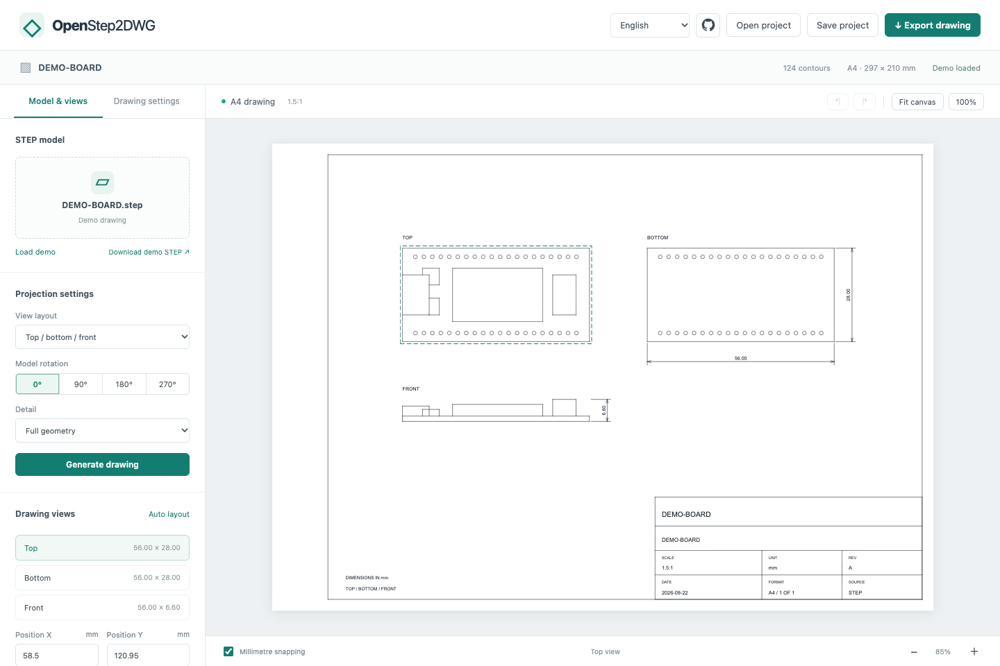

[简体中文](README.md) | [English](README.en.md)

<div align="center">
  
  <h1>OpenStep2DWG</h1>
  <p><strong>A browser-only STEP to DWG workbench</strong></p>
  <p>Import a model · Arrange orthographic views · Export an engineering drawing</p>
  <p>
    <a href="https://geekheart.github.io/OpenStep2DWG/?lang=en"><strong>Open the workbench →</strong></a>
    &nbsp; · &nbsp; <a href="#quick-start">Run locally</a>
    &nbsp; · &nbsp; <a href="#deployment-and-releases">Deployment</a>
    &nbsp; · &nbsp; <a href="https://github.com/geekheart/OpenStep2DWG/releases">Download a release</a>
  </p>
  <p><code>Browser only</code> &nbsp; <code>A4 millimetre canvas</code> &nbsp; <code>DWG / DXF / SVG / PNG</code></p>
</div>

[](https://github.com/geekheart/OpenStep2DWG/actions/workflows/pages.yml)
[](https://github.com/geekheart/OpenStep2DWG/releases/latest)
[](LICENSE)



Choose the model orientation and view layout on the left. Drag views and zoom the central canvas. **Drawing settings** controls scale, dimensions and the title block. **Export drawing** produces editable DWG / DXF files or SVG / PNG images.

## Features

| Feature | Description |
| --- | --- |
| STEP orthographic views | Import `.step` / `.stp` with exact hidden-line removal; top / bottom / front or first-angle layout |
| Model orientation | 0° / 90° / 180° / 270°; full geometry or thin board-layer simplification |
| A4 layout | Landscape canvas in millimetres, automatic scale, dragging and alignment, numeric positions, undo and redo |
| Drawing annotations | Overall dimensions, frame, drawing number, revision and date; dimensions retain actual millimetres after scaling |
| CAD export | AutoCAD 2000 DWG / DXF with native lines, arcs, splines and dimensions |
| Image export | Vector SVG; PNG at 150 / 300 / 600 DPI; download and browser-supported Save as |
| Project files | JSON stores projected geometry and layout settings for continued editing and export |
| Conversion recovery | Retain the parsed model and completed views, retry empty views independently and cache projected results locally |

Model reading, projection and file generation run entirely in the browser. Source files are never uploaded. Desktop Chrome / Edge is recommended. A downloadable, generated development-board demo is included for trying layout and export.

The default interface is Simplified Chinese. Select **English** in the header or open the [English deep link](https://geekheart.github.io/OpenStep2DWG/?lang=en). Switching languages preserves the model, layout and undo history. The adjacent GitHub icon opens this repository. Interface translations never rewrite filenames, drawing numbers, user-entered text or CAD standard fields.

## From model to drawing

### Import and project

1. Click the file card to select a local STEP, or drop the file onto the canvas. Conversion starts automatically.
2. After changing the view layout or rotation, click **Generate drawing**.
3. Use the wheel to zoom and drag empty space to pan. Drag a view or enter its position in millimetres.
4. Adjust the scale and title block in **Drawing settings**, then select **Export drawing**.

Progress shows the current stage and elapsed time. The first exact projection of a complex model may take several minutes; conversion can be cancelled. Selecting the same file with the same settings restores cached projections. Full geometry mode retains the entire model. **Simplify thin board layers** removes thin details using geometric rules; inspect the result before using it in a drawing.

### Scale and annotations


**Fit scale automatically** fits the three views inside the A4 frame. Disable it to enter a drawing scale. Dimension labels continue to show actual model dimensions in millimetres. Drawing number, revision and date are saved in the JSON project.

Keyboard shortcuts: `Ctrl/⌘ Z` to undo, `Ctrl/⌘ Shift Z` to redo and `Ctrl/⌘ S` to save a project. With a view selected and focused, arrow keys move it; hold Shift for 5 mm steps.

### Export and continue editing


Select a format, wait for the file to be prepared, then click **Download file** or **Save as**. DWG output is read back and checked in a Worker. PNG offers selectable resolution; SVG retains vector outlines. Exported drawings omit editor selection boxes.

**Save project** includes computed projections, orientation, scale, positions and the title block. Reopen the JSON to arrange or export the drawing. The original STEP is not embedded: select the source file again to recalculate projections.

## Quick start

Requires Node.js 24 or newer. The repository includes a compiled DWG WebAssembly engine; ordinary frontend development does not require Rust.

```sh
git clone https://github.com/geekheart/OpenStep2DWG.git
cd OpenStep2DWG
npm ci
npm run build
npm run dev
```

Open <http://127.0.0.1:4178>, or append `?lang=en`. The development server only serves static files; the page does not call a conversion service. After changing source files, run `npm run build` again and refresh.

## Browser-only implementation

```text
Local STEP → OpenCascade.js / WASM (exact HLR)
           → Orthographic geometry JSON → A4 layout → DXF
           → acadrust / WASM → DWG → Roundtrip validation → Download
```

Both engines run in dedicated Workers. Source files are never uploaded. Cancelling terminates the Worker and releases its memory. Frame and layout edits do not recompute STEP geometry.

Some complex assemblies can produce an empty later view when several directions are projected in one WASM instance, even though that view works independently. The workbench takes a BREP snapshot preserving the original surfaces and curves, recalculates that direction in a fresh Worker, and reuses completed views. Recovery still uses exact hidden-line removal and the selected detail settings. If the independent calculation fails, the workbench reports the specific view and retains the model for retrying. Each recovered view's `isolated` flag is recorded in JSON.

### Why importing takes time

After you select a file, the browser reads it locally, parses STEP, builds solids, computes exact bounds and performs hidden-line removal in three directions. Progress shows the current stage and elapsed time. There is no upload step. The initial network requests download static computation engines.

- The geometry engine is precompressed: 48.0 MiB → 13.2 MiB, approximately 72% less data to download. The browser decompresses and runs the same WASM. Browsers without `DecompressionStream` fall back to the original file.
- An import retains one Worker and the parsed model. Changing the view set reuses overlapping views and computes only missing directions. The same File object is not reread or rehashed.
- IndexedDB caches projections by source SHA-256, projection parameters and kernel/algorithm version, up to four entries and 64 MiB. It does not save the original STEP. Reselecting the same file can restore projections without loading or starting the kernel. If caching is unavailable, normal conversion continues.
- Cache data belongs to the current browser and site and may be cleared by the browser. Remove it through the browser's site-data settings. Use **Save project** to keep a JSON file for long-term storage.

These optimizations reduce engine downloads and repeated calculations. The first exact projection of a complex model may still take several minutes, depending on model complexity and the computer.

- [OpenCascade.js](https://github.com/donalffons/opencascade.js): pinned to `2.0.0-beta.b5ff984`, obtained through npm integrity verification.
- [acadrust](https://github.com/hakanaktt/acadrust): pinned to `0.5.5`; Rust wrapper source is in [engine/src/lib.rs](engine/src/lib.rs).
- [WASM build script](scripts/build-engine.sh): after installing Rust, run `bash scripts/build-engine.sh` to rebuild the replaceable engine in `engine/pkg/`.
- [Third-party notices](THIRD_PARTY_NOTICES.md) and [license texts](docs/licenses/).

## Current limitations

- Output is a **2D engineering DWG**, without 3D ACIS solids. The preview shows the exported 2D drawing. There is no freely rotatable 3D preview or general DWG viewer.
- Drawings use millimetres. Geometry is scaled to the drawing; dimension scale compensation displays actual millimetres.
- Lines, arcs and convertible NURBS retain native CAD entities. A small number of unsupported curves are discretized with a 0.01 mm tolerance; the count is reported in **Model information** and conversion feedback. SVG / PNG render splines with the same tolerance.
- Exact projection is computationally expensive. Complex board STEP files may take several minutes on a desktop browser. The current file limit is 150 MB; practical capacity depends on geometry complexity and browser memory.
- The geometry engine downloads approximately 13.2 MiB initially (48 MiB decompressed); the DWG engine is approximately 4.3 MiB. Browsers may cache these static resources.
- Automatic dimensions describe the projected envelope. They do not infer tolerances, machining datums or assembly requirements. Thin-layer simplification is intended for models whose main board plane is parallel to XY; inspect the result.
- Internal DWG roundtrip checks do not replace compatibility testing across all CAD applications. Independent verification methods and records are in [Validation notes](docs/VALIDATION.md).

## Development and validation

```sh
npm test
npx playwright install chromium
npm run build
npm run test:e2e
```

Local end-to-end tests use installed Chrome by default; CI uses Playwright Chromium. Run `STEP_TEST_FILE=/path/to/model.step npm run test:e2e -- --grep 'real STEP regression'` for a local real-model regression. Test models are not included in the static site.

The workflow also rebuilds the DWG engine from locked Cargo dependencies using Rust 1.98.1 and wasm-bindgen 0.2.128, then reruns geometry and export tests. Browser tests cover conversion, cancellation, empty-view recovery, caching, canvas interactions, project restoration, localization and actual downloads in all four formats. Screenshots come from the running application.

```text
app.js                    UI, canvas interaction, projects and downloads
src/i18n.js               Chinese/English messages, Worker descriptors and language switching
src/occt-kernel.js         STEP reading and exact hidden-line removal
src/step-worker.js         Model sessions and view reuse
src/projection-worker.js   Failed-view recovery in an isolated kernel
src/model.js               A4 layout, dimensions and SVG
src/dxf.js                 CAD entities and native dimension output
src/dwg-worker.js          DWG encoding and roundtrip checks
engine/                   Rust wrapper, locked dependencies and WASM
tests/                    Geometry, drawing and browser regressions
docs/                     Screenshots, independent CAD validation and licenses
.github/workflows/        Automated checks, Pages and Release
```

`DEMO-BOARD.step` is a generic development-board fixture generated by this project. Recreate it with `node scripts/create-demo.mjs`. It contains no customer HDK or product model.

## Deployment and releases

### GitHub Pages

Live site: **[geekheart.github.io/OpenStep2DWG](https://geekheart.github.io/OpenStep2DWG/?lang=en)**

The [publishing workflow](.github/workflows/pages.yml) follows the static deployment approach used by [OpenBoxHub](https://github.com/geekheart/OpenBoxHub):

| Trigger | Result |
| --- | --- |
| Pull request to `main` | Install locked dependencies, compile the engine, test, build and run browser checks |
| Push to `main` | Publish GitHub Pages after successful checks |
| Push a `V<number>…` or `v<number>…` tag | Run checks, publish Pages, and create a GitHub Release with a static-site ZIP and SHA-256 checksums |
| Manual run | Select `main` or a version tag and run the same verification and publishing process |

To deploy a fork:

1. Fork the repository and enable Actions.
2. Under **Settings → Pages**, select **GitHub Actions** as the source.
3. Under **Settings → Environments → github-pages**, permit the `main` branch and `V*` / `v*` tags.
4. Push code or manually run **Verify and publish OpenStep2DWG** in Actions.
5. Open the Pages URL after all jobs succeed.

Example commands for `V1.0.1` follow. For subsequent versions, first update `package.json`, `package-lock.json`, `CHANGELOG.md` and bilingual `docs/releases/V<version>.md` notes. The tag must match the package version.

```sh
git tag -a V1.0.1 -m "OpenStep2DWG V1.0.1"
git push origin main V1.0.1
```

Creating a local tag alone does not trigger Actions; push it to the remote. Production publishing jobs run serially. Pull requests receive no Pages or Release write permissions.

### Any static server

Run `npm ci && npm run build` and deploy the entire `dist/` directory, or extract the static-site ZIP from a [Release](https://github.com/geekheart/OpenStep2DWG/releases/latest). Preserve the directory structure and serve over HTTP / HTTPS:

```sh
python3 -m http.server 8080 --bind 127.0.0.1 --directory dist
```

The release ZIP contains site files at its root. Replace `dist` above with the extracted directory. The server must serve `.wasm` correctly. The application decompresses `.wasm.gz` itself, so do not add a `Content-Encoding: gzip` response header to that file. All resource paths are relative and support GitHub Pages project subdirectories. Use HTTP / HTTPS: `file://` cannot reliably load Workers and WASM.

## License and contributions

Application code is licensed under [MIT](LICENSE), copyright © 2026 geekheart. CAD engines and other dependencies retain their own licenses; see [Third-party notices](THIRD_PARTY_NOTICES.md). Development rules are in [AGENTS.md](AGENTS.md), and version history is in [CHANGELOG.md](CHANGELOG.md). When reporting a conversion issue, include your browser version, view layout, rotation and failing stage. Only share a minimal model you are permitted to publish.
