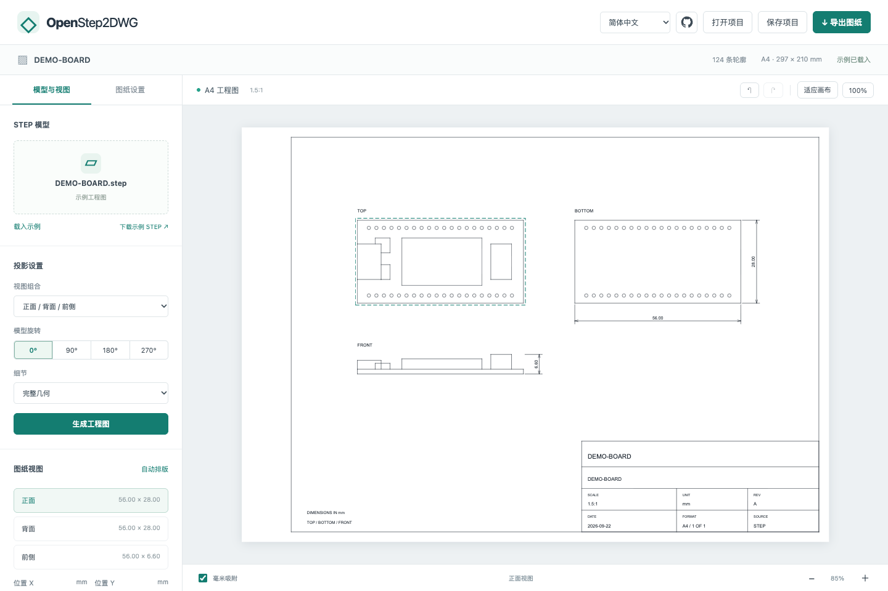
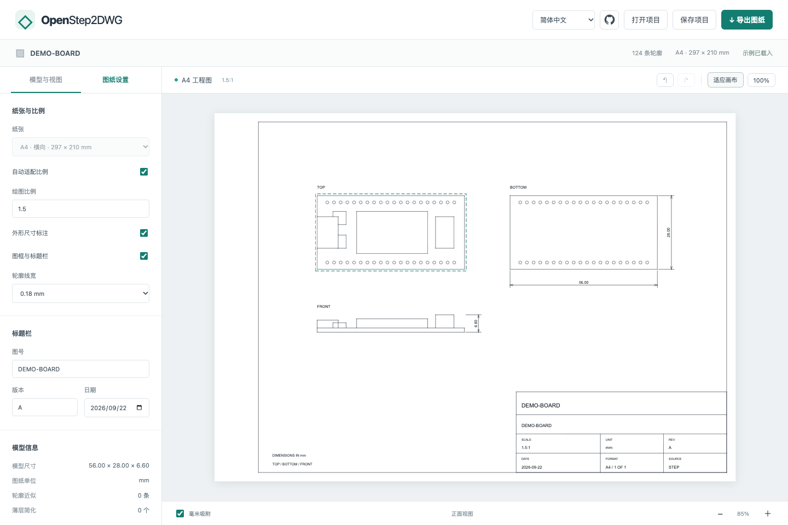
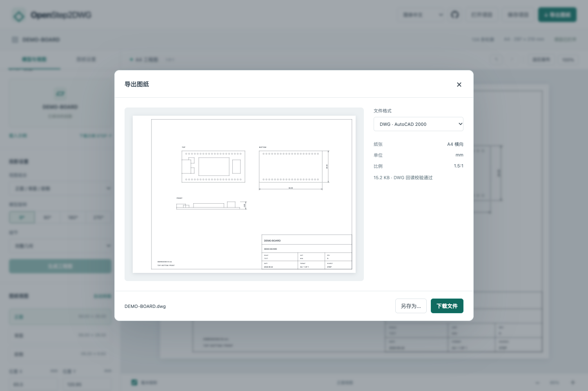

[简体中文](README.md) | [English](README.en.md)

<div align="center">
  
  <h1>OpenStep2DWG</h1>
  <p><strong>浏览器里的 STEP 转 DWG 工作台</strong></p>
  <p>导入模型 · 排版三视图 · 导出工程图</p>
  <p>
    <a href="https://geekheart.github.io/OpenStep2DWG/"><strong>打开在线工作台 →</strong></a>
    &nbsp; · &nbsp; <a href="#快速开始">本地运行</a>
    &nbsp; · &nbsp; <a href="#部署与发布">部署指南</a>
    &nbsp; · &nbsp; <a href="https://github.com/geekheart/OpenStep2DWG/releases">下载发行版</a>
  </p>
  <p><code>纯前端</code> &nbsp; <code>A4 毫米画布</code> &nbsp; <code>DWG / DXF / SVG / PNG</code></p>
</div>

[](https://github.com/geekheart/OpenStep2DWG/actions/workflows/pages.yml)
[](https://github.com/geekheart/OpenStep2DWG/releases/latest)
[](LICENSE)



左侧选择模型方向和视图组合；中间拖动视图、缩放画布；「图纸设置」调整比例、尺寸标注和标题栏。「导出图纸」生成可编辑的 DWG / DXF 或 SVG / PNG。

## 可以做什么

| 功能 | 说明 |
| --- | --- |
| STEP 三视图 | 导入 `.step` / `.stp`，精确隐藏线投影；正面 / 背面 / 前侧或第一角法 |
| 模型方向 | 0° / 90° / 180° / 270°；完整几何或板面薄层简化 |
| A4 排版 | 横向毫米画布、自动比例、视图拖动与对齐、坐标输入、撤销和重做 |
| 工程标注 | 外形尺寸、图框、图号、版本、日期；修改比例后仍显示真实毫米尺寸 |
| CAD 导出 | AutoCAD 2000 DWG / DXF，保留原生直线、圆弧、样条和尺寸标注 |
| 图像导出 | SVG 矢量图；PNG 150 / 300 / 600 DPI；下载与浏览器支持的「另存为」 |
| 项目保存 | JSON 包含投影几何和排版参数，打开后可直接编辑、导出 |
| 转换恢复 | 保留已解析模型与已有视图；空视图自动独立重算；转换结果缓存在本地 |

模型读取、投影与文件生成均在浏览器中执行，源文件不上传。推荐使用桌面版 Chrome / Edge。页面自带可下载的通用开发板示例，打开即可试用排版与导出。

页面默认使用简体中文；右上角可随时切换 English，切换不会重置模型、排版或撤销记录。英文直达地址：[English workbench](https://geekheart.github.io/OpenStep2DWG/?lang=en)。旁边的 GitHub 图标可打开本仓库。语言只改变界面提示，不改写文件名、图号、用户填写内容或 CAD 标准字段。

## 从模型到工程图

### 导入与投影

1. 点击左侧文件卡片选择本地 STEP，或把文件拖入画布，自动开始转换。
2. 更换视图组合或旋转方向后，点击「生成工程图」。
3. 滚轮缩放画布，空白处拖动平移；拖动一个视图调整位置，或输入毫米坐标。
4. 在「图纸设置」调整比例和标题栏，点击「导出图纸」。

进度显示当前阶段和耗时。复杂模型首次精确投影可能需要数分钟，可随时取消；再次选择同一文件、同一参数时，直接读取已有投影缓存。完整模式保留全部模型；「简化板面薄层」按几何规则移除板面上的薄层细节，需要确认结果后再用于制图。

### 调整比例与标注



「自动适配比例」把三视图放入 A4 图框；关闭后可输入绘图比例。尺寸标注仍显示模型的实际毫米尺寸。标题栏中的图号、版本和日期随 JSON 项目一起保存。

快捷键：`Ctrl/⌘ Z` 撤销，`Ctrl/⌘ Shift Z` 重做，`Ctrl/⌘ S` 保存项目。选中视图后用方向键移动，按住 Shift 每次移动 5 mm。

### 导出与继续编辑



选择格式，等待文件准备完成后点击「下载文件」或「另存为」。DWG 生成后会在 Worker 中回读检查；PNG 可设置分辨率，SVG 保留矢量轮廓。导出图纸不包含编辑时的选中框。

「保存项目」包含已计算的投影、方向、比例、坐标和标题栏。再次打开 JSON 即可排版和导出；原始 STEP 不嵌入 JSON，重新计算投影时需重新选择源文件。

## 快速开始

需要 Node.js 24 或更新版本。仓库包含编译好的 DWG WebAssembly，普通前端开发无需安装 Rust。

```sh
git clone https://github.com/geekheart/OpenStep2DWG.git
cd OpenStep2DWG
npm ci
npm run build
npm run dev
```

打开 <http://127.0.0.1:4178>。开发服务器仅提供静态文件；页面不调用任何转换服务。修改源文件后重新运行 `npm run build` 并刷新页面。

## 纯前端实现

```text
本地 STEP → OpenCascade.js / WASM（精确 HLR）
         → 三视图几何 JSON → A4 排版 → DXF
         → acadrust / WASM → DWG → 回读校验 → 下载
```

两种内核均运行在独立 Worker 中；源文件不上传。取消操作直接终止 Worker 并释放其内存。更改图框或排版不重复计算 STEP。

部分复杂装配在同一个 WASM 实例连续生成多个方向时，会出现单独投影正常、后续视图为空的情况。工作台会从原模型生成保留曲面和曲线的 BREP 快照，在全新的 Worker 中重算该方向，并复用其他视图。恢复过程仍使用精确隐藏线算法和当前细节设置；如果独立计算仍失败，会报告具体视图并保留模型供重试。各视图的 `isolated` 标记记录在 JSON 中。

### 为什么导入需要等待

选择文件后，浏览器先读取本地文件，再执行 STEP 解析、实体构建、精确外形尺寸计算和三个方向的隐藏线投影。进度显示当前阶段及耗时；这里没有模型上传过程。首次使用的网络请求是下载静态计算内核。

- 几何内核采用预压缩文件：48.0 MiB → 13.2 MiB，下载体积减少约 72%；浏览器解压后执行相同的 WASM。不支持 `DecompressionStream` 的浏览器回退到原始文件。
- 一次导入保留一个 Worker 和当前已解析模型；更换视图组合时，复用重合视图，仅计算缺少的方向。同一 File 对象不重复读取和计算摘要。
- IndexedDB 按源文件 SHA-256、投影参数和内核/算法版本缓存结果，最多 4 组、64 MiB，不保存原始 STEP。再次选择同一文件可直接恢复投影，无需下载或启动内核；缓存不可用时自动正常转换。
- 缓存属于当前浏览器和站点，可能被浏览器清理，可通过浏览器的站点数据设置删除。需要长期保留时请「保存项目」为 JSON。

这些优化减少内核下载与重复计算；复杂模型首次进行精确投影仍可能需要数分钟，取决于模型复杂度和本机性能。

- [OpenCascade.js](https://github.com/donalffons/opencascade.js)：锁定 `2.0.0-beta.b5ff984`，通过 npm 完整性校验取得几何内核。
- [acadrust](https://github.com/hakanaktt/acadrust)：锁定 `0.5.5`，Rust 包装器源码在 [engine/src/lib.rs](engine/src/lib.rs)。
- [WASM 编译脚本](scripts/build-engine.sh)：安装 Rust 后执行 `bash scripts/build-engine.sh`，可替换 `engine/pkg/` 下的内核。
- [第三方声明](THIRD_PARTY_NOTICES.md)与[许可证文本](docs/licenses/)。

## 当前边界

- 输出是 **二维工程 DWG**，不包含三维 ACIS 实体；预览显示将导出的二维图纸，当前没有自由旋转的三维预览或任意 DWG 文件查看器。
- 图纸按毫米绘制，几何按图纸比例缩放；尺寸标注使用比例补偿显示实际毫米值。
- 直线、圆弧和可转换的 NURBS 保留原生 CAD 实体。不能精确转换的少数曲线会按 0.01 mm 公差离散，并在「模型信息」和转换结果中报告数量。SVG / PNG 中的样条按相同公差绘制。
- 精确投影较耗时。复杂开发板 STEP 在桌面浏览器中可能需要数分钟；当前单文件上限为 150 MB，实际可处理大小仍取决于几何复杂度和浏览器内存。
- 首次转换下载的几何内核约 13.2 MiB（解压后 48 MiB），DWG 内核约 4.3 MiB；静态资源可由浏览器缓存。
- 自动尺寸是投影视图的整体包络尺寸，不自动推断公差、加工基准或装配要求。薄层简化适合主要板面平行于 XY 平面的模型，需检查结果。
- DWG 内部回读不能代替所有 CAD 软件的兼容性测试；独立验证方法与记录见 [验证说明](docs/VALIDATION.md)。

## 开发与验证

```sh
npm test
npx playwright install chromium
npm run build
npm run test:e2e
```

本地端到端测试默认使用已安装的 Chrome；CI 使用 Playwright Chromium。`STEP_TEST_FILE=/path/to/model.step npm run test:e2e -- --grep 'real STEP regression'` 可运行本地真实模型回归。测试模型不进入静态站点。

工作流还会使用 Rust 1.98.1 与 wasm-bindgen 0.2.128，从锁定的 Cargo 依赖重建 DWG 内核，重新运行几何与导出测试。浏览器测试覆盖转换、取消、空视图恢复、缓存、画布操作、项目恢复以及四种格式的真实下载；截图由实际页面生成。

```text
app.js                    界面、画布交互、项目与下载
src/i18n.js               中英文翻译、Worker 消息与语言切换
src/occt-kernel.js         STEP 读取与精确隐藏线投影
src/step-worker.js         模型会话和视图复用
src/projection-worker.js   独立内核恢复失败视图
src/model.js               A4 排版、标注和 SVG
src/dxf.js                 CAD 实体与原生尺寸输出
src/dwg-worker.js          DWG 编码和回读
engine/                   Rust 包装器、锁定依赖及 WASM
tests/                    几何、工程图与浏览器回归
docs/                     界面截图、独立 CAD 验证及许可
.github/workflows/        自动检查、Pages 与 Release
```

示例 `DEMO-BOARD.step` 为本项目程序生成的通用开发板几何，可运行 `node scripts/create-demo.mjs` 重建。它不包含客户 HDK 或产品模型。

## 部署与发布

### GitHub Pages

在线地址：**[geekheart.github.io/OpenStep2DWG](https://geekheart.github.io/OpenStep2DWG/)**

[发布工作流](.github/workflows/pages.yml) 参考 [OpenBoxHub](https://github.com/geekheart/OpenBoxHub) 的静态部署方式：

| 触发方式 | 执行结果 |
| --- | --- |
| Pull Request 到 `main` | 安装锁定依赖、编译内核、测试、构建和浏览器检查 |
| 推送 `main` | 完成检查后发布 GitHub Pages |
| 推送 `V数字…` 或 `v数字…` 标签 | 完成检查后发布 Pages，创建 GitHub Release 与静态站点 ZIP、SHA-256 校验文件 |
| 手动运行 | 选择 `main` 或版本标签，执行相同检查与发布流程 |

部署自己的副本：

1. Fork 仓库并启用 Actions。
2. 在 **Settings → Pages** 将 Source 设为 **GitHub Actions**。
3. 在 **Settings → Environments → github-pages** 中允许 `main` 分支，以及 `V*` / `v*` 标签。
4. 推送代码，或在 Actions 中手动运行 **Verify and publish OpenStep2DWG**。
5. 等待全部任务通过后打开 Pages 地址。

发布 `V1.0.1` 的命令如下。后续版本先更新 `package.json`、`package-lock.json`、`CHANGELOG.md` 和 `docs/releases/V版本号.md` 中的中英文发布说明；标签版本须与包版本一致。

```sh
git tag -a V1.0.1 -m "OpenStep2DWG V1.0.1"
git push origin main V1.0.1
```

仅创建本地标签不会触发 Actions，需要将标签推送到远端。发布任务串行运行；PR 没有 Pages 或 Release 写入权限。

### 任意静态服务器

运行 `npm ci && npm run build` 后部署完整 `dist/`，或下载 [Release](https://github.com/geekheart/OpenStep2DWG/releases/latest) 中的静态站点 ZIP 并解压。保留目录结构，通过 HTTP / HTTPS 提供访问：

```sh
python3 -m http.server 8080 --bind 127.0.0.1 --directory dist
```

发行版 ZIP 解压后直接包含站点文件，将上面命令的 `dist` 替换为解压目录。服务器需正确提供 `.wasm` 文件；`.wasm.gz` 是由应用主动解压的静态文件，不要再额外设置 `Content-Encoding: gzip`。所有资源路径均为相对路径，支持 GitHub Pages 仓库子目录。请通过 HTTP / HTTPS 打开，`file://` 无法可靠加载 Worker 和 WASM。

## 许可与贡献

应用代码使用 [MIT](LICENSE)（Copyright © 2026 geekheart）；CAD 内核及其他依赖保留各自许可证，见 [第三方声明](THIRD_PARTY_NOTICES.md)。开发约定见 [AGENTS.md](AGENTS.md)，版本变化见 [CHANGELOG.md](CHANGELOG.md)。反馈转换问题时请说明浏览器版本、视图组合、旋转角度及报错阶段；仅提交允许公开的最小复现模型。
